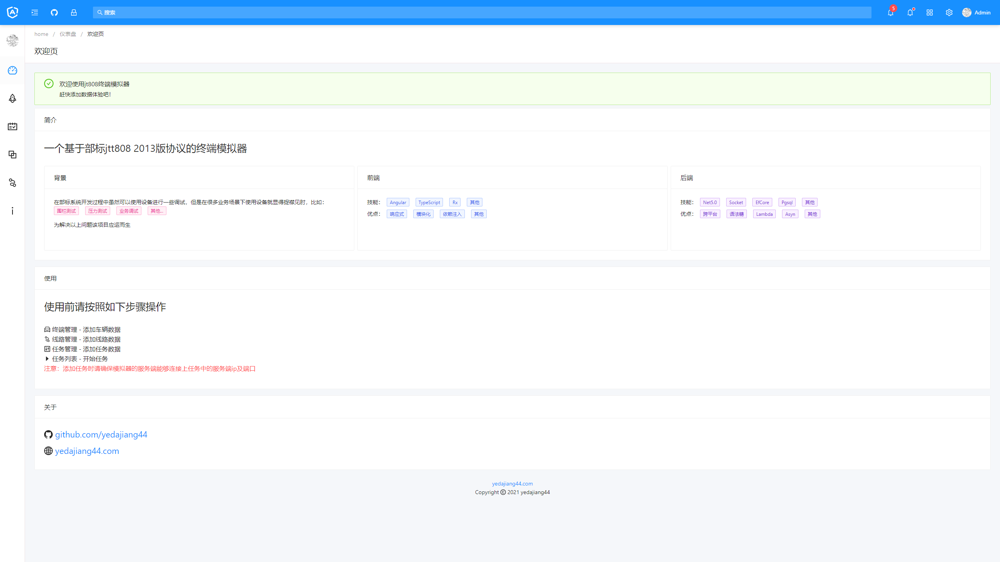

# GpsTerminalEmulator

基于部标协议的终端模拟器的服务端

特色功能：根据基准点、速度重新插值计算出更为真实的设备定位数据，最大化数据模拟的真实性。

<div align="center">
      
</div>

前端代码详见[TerminalEmulatorWeb](https://github.com/yedajiang44/TerminalEmulatorWeb)

## 部署使用

为了方便大家使用，已提供 docker 镜像，

> docker 安装请参照官方文档

- `touch docker-compose.yml`

- 复制[docker-compose.yml](./docker-compose.yml)内容至刚才新建的`docker-compose.yml`文件中

- 执行`docker-compose up -d`

- 浏览器打开`localhost:4000`

## 二次开发

### 开发环境

- net5.0

- PostgreSql

- 部标 Jt808 服务端(非必须)

### 生成迁移

- 为了快速开发，该项目的 808 协议解析器使用的是我自己的库，因此请先添加我私人的 nuget 服务`http://nuget.yedajiang44.com/v3/index.json`或直接移除`Jt808TerminalEmulator.Core`项目里的`GpsPlatform.Jt808Protocol`包，并使用你自己的协议库

- 按需更改 [appsettings.json](src/Jt808TerminalEmulator.Api/appsettings.json) 如数据库连接

- 由于项目使用 `codefirst`，因此无需手动创建数据库，但是在运行项目前需要执行迁移，可以执行`migration.sh`脚本，也可以直接执行迁移命令

### 运行项目

直接运行`Jt808TerminalEmulator.Api`项目，直到控制台输出如下内容

```
 _   _          _   _                   _   _      ___     ___     ___    _
| | | |   ___  | | | |   ___           | | | |_   ( _ )   / _ \   ( _ )  | |
| |_| |  / _ \ | | | |  / _ \       _  | | | __|  / _ \  | | | |  / _ \  | |
|  _  | |  __/ | | | | | (_) |  _  | |_| | | |_  | (_) | | |_| | | (_) | |_|
|_| |_|  \___| |_| |_|  \___/  ( )  \___/   \__|  \___/   \___/   \___/  (_)
                               |/
```

## 友情提醒及免责声明

为避免该项目被投机者利用，特做此声明：`违反以下提醒造成的一切违法行为由使用者个人或单位自行承担，与作者无关`

- 本项目仅适用于本地开发或内部测试时使用

- 请勿恶意并发进攻他人服务器

- 请勿为了运营商考核而使用本工具

**如果同意以上声明方可使用该项目**

## 已知问题

- efcore 部分使用跟踪查询导致查询速度较慢

- 定位中无方向数据

- 模拟时未进行注册鉴权

## Rodmap

- 修复已知问题

- 添加压测功能

## License

[Apache License 2.0](LICENSE)
